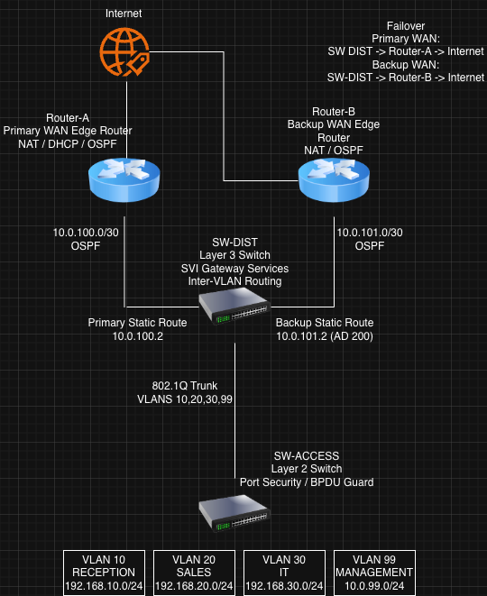

# KhaleelCorp Enterprise Network + Automation Dashboard

## Project Overview
A fully functional enterprise-style network built on physical Cisco hardware,
simulating a real enterprise branch office deployment. 

Project implements enterprise routing and switching, dual-WAN internet resiliency, NAT services, OSPF failover testing, Python automation, and a Flask monitoring dashboard.

Operational data is collected from Cisco devices via SSH using Python and visualized through a web dashboard.

The project was developed and validated using physical Cisco hardware.

## Hardware Used
- 2× Cisco ISR4331/K9 (IOS XE) — primary and failover routers
- Cisco WS-C3750G-24TS-S1U — distribution/Layer 3 switch
- Cisco WS-C2960-24TT-L — access layer switch

## Technologies Implemented

### Networking
- VLAN segmentation
- 802.1Q trunking
- Inter-VLAN routing using SVIs
- OSPFv2 Area 0
- Default route advertisement
- NAT overload (PAT)
- DHCP services
- Static + dynamic routing validation

### Security
- SSHv2 remote management
- Port security (sticky MAC)
- BPDU Guard
- VLAN isolation

### High Availability
- OSPF-based internal failover testing
- Primary/backup router topology

### Automation & Monitoring
- Python automation using Netmiko
- SSH data collection
- JSON snapshot storage
- Flask monitoring dashboard
- Historical snapshot browsing

### WAN Redundancy & Failover

- Dual-WAN architecture
- Primary and backup internet edge routers
- Floating static route failover
- WAN resiliency validation
- NAT failover testing
- Routing convergence testing

## Infrastructure Validation

The following infrastructure scenarios were successfully tested and validated:

- VLAN segmentation
- Inter-VLAN routing
- OSPF neighbor adjacency
- Dynamic route propagation
- NAT overload (PAT)
- DHCP services
- Internet connectivity
- Internal OSPF failover
- Dual-WAN failover
- Backup NAT functionality
- Routing convergence testing
- SSH remote management
- Python automation connectivity
- Dashboard monitoring visibility

## Network Diagram

## Video Demo

## WAN Failover Design

The infrastructure uses dual edge routers for WAN resiliency:

- Router-A operates as the primary internet edge router
- Router-B operates as the backup internet edge router

SW-DIST uses floating static routes to support failover from Router-A to Router-B during WAN outage testing.

### Primary Path
SW-DIST → Router-A → ISP

### Backup Path
SW-DIST → Router-B → ISP

Failover testing validated:
- routing convergence
- internet recovery
- NAT functionality on backup router
- operational resiliency

## Dashboard Screenshot

## Repository Structure
- /configs — full running configs for all 4 devices
- /evidence — show command output proving each feature works
- /automation - Python automation + dashboard code
- network-handoff.md — handoff doc written for IT ops team

